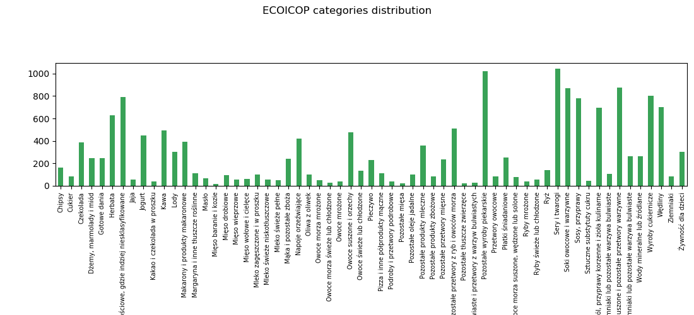

# ECOICOP classification

## Goals of the project:
* automation of the ECOICOP product classification process
* replacement of the manual classification by the Machine Learning methods

The dataset is located in the .xlsx file: **products_allshops_dataset.xlsx**. 
It includes the list of nearly 16700 products names which are labelled by the 61 unique Ecociop categories.

In our project we were testing 4 methods:
* Logistic Regression
* Random Forest
* SVM
* Naive Bayes

## Hyperparameters tunning
Best model parameters have been searched in two ways:
1. First two methods have been tested with the use of *for* loop:  
    - **Logistic Regression** - tested parameters:
        - c (0.1, 1, 2, 3)
        - fit_intercept (True, False)
        - class_weight (None, 'balanced')
        - solver ("newton-cg", "lbfgs", "liblinear", "sag", "saga")
        - multi_class ("ovr", "multinomial")
        - max_iter = 200  
    - **Random Forest** - tested parameters:
        - n_estimators (30, 100, 150, 200)
        - criterion ('gini', 'entropy')
        - min_samples_leaf (1, 2, 3)
        - min_samples_split (2, 3)
        - max_features (None, "sqrt", "log2")
        - bootstrap (True, False)
        - oob_score (True, False)
        - warm_start (True, False)
        - class_weight (None, 'balanced', 'balanced_subsample')

    When you run the file **logistic_regression.py**, all the results will be included in the file **results_logistic_regression.xlsx**. 
    When you run the file **random_forest.py**, all the results will be included in the file **results_random_forest.xlsx**.

2. Last two methods have been tested with the use of *Gridsearch cross-validation* over a parameter grids presented below:  
    - **Naive Bayes** - tested parameters:
        - alpha (np.linspace(0.5, 1.5, 6))
        - fit_prior (True, False)
        - max_df (np.linspace(0.1, 1, 10))
        - sublinear_tf (True, False)
        - ngram_range ((1,1),(1,2))
        - stop_words (stop_words_list, None)  
    - **SVM** - tested parameters:
        - penalty ('l1', 'l2')
        - multi_class ('ovr','crammer_singer')
        - C (0.01, 0.1, 1, 10, 100, 1000)
        - loss: ('hinge','squared_hinge')

    The results of running the script file **linear_SVC_params_tunn.py** will be included in the **GridsearchCV_results_LinSVC.xlsx** file.  
    The results of running the script file **naive_bayes_params_tunn.py** will be included in the **GridsearchCV_results_NB.xlsx** file.

Best chosen parameters were implemented and analysed. The results are presented below.

## Model evaluation
### Logistic Regression
Script file **logistic_regression_results.py** generates results:
- training data:
    - accuracy: 0.98
    - F1-score: 0.98
    - MCC: 0.98
- validation data:
    - accuracy: 0.92
    - F1-score: 0.92
    - MCC: 0.92
- test data:
    - accuracy: 0.91
    - F1-score: 0.91
    - MCC: 0.90

### Random Forest
Script file **random_forest_results.py** generates results:
- training data:
    - accuracy: 1.00
    - F1-score: 1.00
    - MCC: 1.00
- validation data:
    - accuracy: 0.93
    - F1-score: 0.93
    - MCC: 0.93
- test data:
    - accuracy: 0.91
    - F1-score: 0.91
    - MCC: 0.91

### Naive Bayes
Script file **naive_bayes_results.py** generates results:
- training data:
    - accuracy: 0.98
    - F1-score: 0.98
    - MCC: 0.98
- validation data:
    - accuracy: 0.89
    - F1-score: 0.89
    - MCC: 0.89
- test data:
    - accuracy: 0.91
    - F1-score: 0.91
    - MCC : 0.91

### SVM
Script file **linear_SVC_results.py** generates results:
- training data:
    - accuracy: 0.995
    - F1-score: 0.995
    - MCC: 0.995
- validation data:
    - accuracy: 0.91
    - F1-score: 0.91
    - MCC: 0.90
- test data:
    - accuracy: 0.92
    - F1-score: 0.92
    - MCC: 0.92

## Other information
By running the scripts mentioned above there will be also generated:
- confusion matrix
- classification report
- joblib files (commented - to create the file, you have to uncomment the code)
- xlsx file with the predicted category and its probability for the test set

Script file **categories_distribution.py** presents the way how to plot the histogram of the ecoicop categories
included in the main dataset and how to save it into image file.

**polish_stopwords.txt** is a file which includes polish stopwords which can be removed from the vectorizer.

## Authors
- Marta Kruczek-Szepel
- Krystyna Piątkowska

